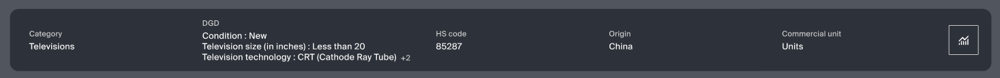
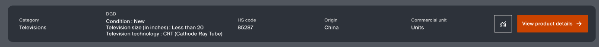

# Welcome to Angular Crash test

You are requested to create a simple component with a given context.  
The purpose is to see your actual knowledge in Angular.

## Context

The component should match the given design.  
The component should be named  "product-recap"  
The component should have an input of a Product (the model is already created).
The component should have an input for each button to hide them.  

For DGD, you should create another component as it could be reused.  
The little "+2" that you see on the first example in the section #Given design, 
is when you have more than 3 Dgds (it only shows the number of exceeded elements).

Screen target is XL 

## Tools
This project is based on Primeng and Primeflex.  
You could use both library to speed/simplify your template.   

Do NOT use any LLM to do this, as the purpose is to know your knowledge and how you work.

## How to run project
You need npm 22+  
npm run install  
npm run start  

### Given design :

Figma examples

Example with both buttons

